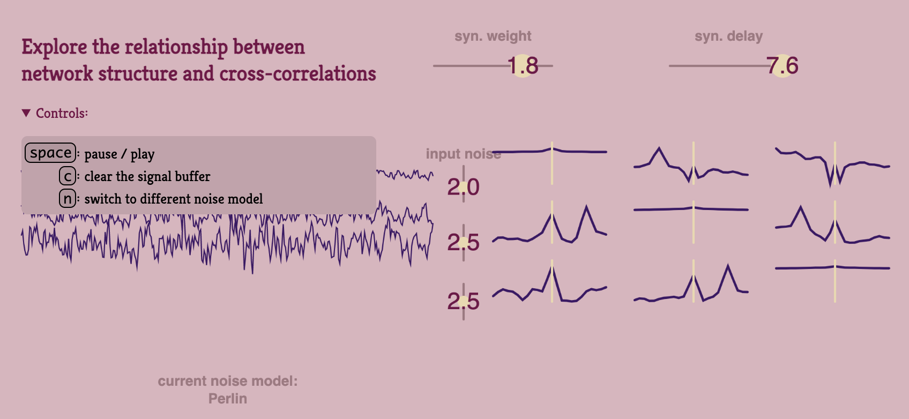

🚧  Work in progress 🚧 

intended to view how correlations between outputs of small networks vary as a function of simple paramters 

notably, this project should import some rendering and generation capability from `circuit-visualizer-p5`
but this project is small enough in scope, it's core pieces should be fine without.

## Upcoming Features
- [ ] Computing ["coincidence index"]() as a measure of connectivity
  - highlight significant connections   
- [ ] Edittable circuit structure ( *see [circuit-visualizer-p5]()*)
  - [ ] better visualization of current circuit structure 
- [ ] Dropdown menu for noise models
- [ ] Edittable buffer length for cross-correlation
- [ ] Exportable quantitative results

## Early observations 
- finer auto-correlations mean easier connectivity inference
- impact of variances on identifiability depends strongly on...
  - which connection is being examined
  - inputs and outputs to that connection
  - ( *stay tuned for a more general hypothesis on relationship between ground truth structure, variance, and Signal-to-noise ratio for Identifiability* )  
- how you normalize matters more when signals are more different from each other  
  - (i.e. normalizing in reciprocal circuits)
  - buffer lenghts longer than ~2k(5k) significantly slow-down script
      - likely *computing* xcorr not rendering it

### Simple findings:
- delay has predictable signature on xcorr  
  - (if autocorr is minimal, influence is delta function)

## Repo organization

## Related projects
- 🕸️ circuit-visualizer-p5 [code](https://github.com/awillats/circuit-visualizer-p5), [demo](https://awillats.github.io/circuit-visualizer-p5/)
- 🌀 dynamics-visualizer-p5 [code](https://github.com/awillats/dynamics-visualizer-p5), [demo](awillats.github.io/dynamics-visualizer-p5/)

